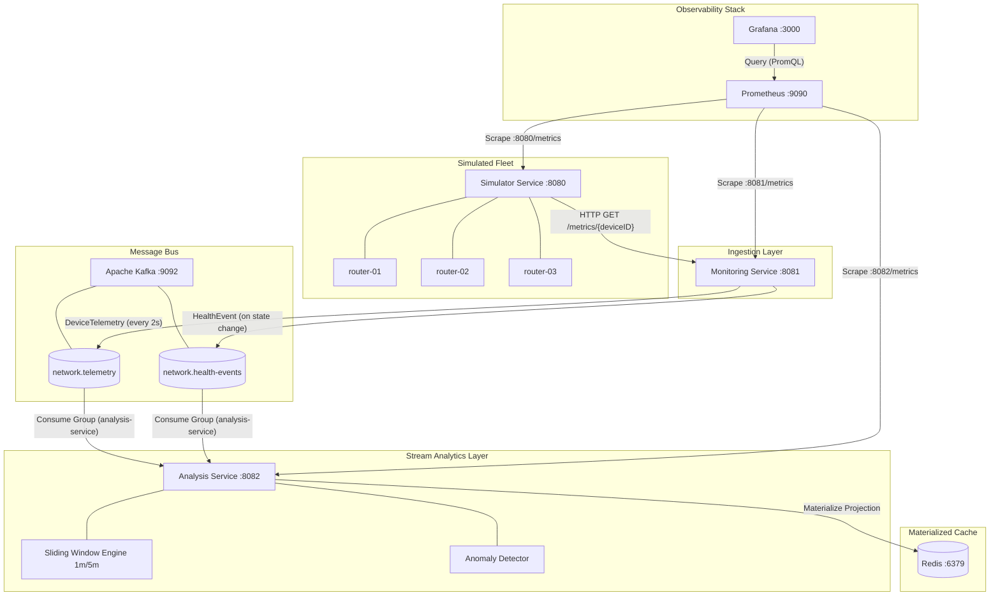

# Distributed Network Monitoring & Telemetry Platform

[](https://go.dev/)
[](https://www.docker.com/)
[](https://kafka.apache.org/)
[](https://redis.io/)
[](https://prometheus.io/)
[](https://grafana.com/)

A production-grade, distributed network monitoring and telemetry platform built in **Go**. The platform simulates physical network devices (routers/switches), continuously ingests telemetry with bounded retries and exponential backoff, evaluates multi-signal device health, streams events over **Apache Kafka**, computes rolling-window metrics and anomaly detection in real time, projects state to **Redis**, and exposes comprehensive metrics to **Prometheus** and **Grafana**.

---

## 1. Architecture Overview

The system decouples edge device simulation, polling ingestion, event streaming, analytical stream processing, state caching, and operational observability into discrete, fault-tolerant microservices.

```text
                    ┌─────────────────────────┐
                    │ Network Device Simulator│
                    │      (port :8080)       │
                    │  router-01, 02, 03...   │
                    └────────────┬────────────┘
                                 │ HTTP Polling (2s ticker)
                                 ▼
                    ┌─────────────────────────┐
                    │   Monitoring Service    │
                    │      (port :8081)       │
                    │  Retries + Health State │
                    └────────────┬────────────┘
                                 │ Kafka Events
                                 ▼
                    ┌─────────────────────────┐
                    │       Apache Kafka      │
                    │  • network.telemetry    │
                    │  • network.health-events│
                    └────────────┬────────────┘
                                 │ Consumer Group
                                 ▼
                    ┌─────────────────────────┐
                    │     Analysis Service    │
                    │      (port :8082)       │
                    │  1m/5m Windows + Anomaly│
                    └───────┬─────────┬───────┘
                            │         │
                 Projection │         │ Query API
                            ▼         ▼
                     ┌──────────┐ ┌────────┐
                     │  Redis   │ │ Client │
                     │  (:6379) │ └────────┘
                     └──────────┘
                          ▲
                          │ Scrapes (/metrics)
               ┌──────────┴──────────┐
               │  Prometheus (:9090) │
               └──────────┬──────────┘
                          │ Datasource
                          ▼
               ┌─────────────────────┐
               │   Grafana (:3000)   │
               └─────────────────────┘
```

---

## 2. Architecture Diagram (Mermaid)



---

## 3. Technology Stack & Engineering Rationale

| Component | Technology | Rationale & Tradeoffs |
| :--- | :--- | :--- |
| **Language** | **Go (1.24)** | High concurrency with low-memory goroutines, predictable garbage collection, fast compilation, statically linked single-binary deployments. |
| **Message Broker** | **Apache Kafka (KRaft)** | Key-based partitioning by `deviceID` guarantees strict FIFO ordering per device; durable commit offsets allow independent stream replay without data loss. |
| **State Cache** | **Redis (7.4-Alpine)** | Sub-millisecond reads/writes for materialized rolling telemetry and active health projections. Eliminates disk WAL bottlenecks for transient operational data. |
| **Observability** | **Prometheus + Grafana** | Industry-standard dimensional metrics collection via pull-based scraping and declarative dashboard provisioning via code. |
| **Containerization**| **Docker Compose** | Reproducible multi-service deployment with isolated networks, resource controls, and healthcheck dependencies. |

---

## 4. Key Engineering Concepts Demonstrated

- **Bounded Retries & Exponential Backoff**: Transient network drops are retried (max 2 retries, 50ms backoff) before incrementing failure counters; fatal errors (404 Not Found) fail fast.
- **Multi-Signal Deterministic Health Evaluation**: Evaluates CPU, memory, latency, packet loss, and link connectivity across `HEALTHY`, `WARNING`, `CRITICAL`, and `DOWN` states. A device is marked `DOWN` only after 3 consecutive poll failures.
- **Partition-Ordered Stream Processing**: Messages are partitioned by `deviceID` in Kafka, guaranteeing ordered stream ingestion per network router across consumer group instances.
- **Bounded Sliding-Window Aggregation**: Rolling 1-minute and 5-minute aggregations (min, max, avg, sample count) computed in memory with automatic time-based eviction and strict ceiling caps to prevent memory leaks.
- **Noise-Suppressed Anomaly Detection**: Statistical anomaly detection filters out isolated transient spikes by enforcing an evaluation threshold ($\ge 2$ samples).
- **Liveness vs. Readiness Probing**: Microservices distinguish process health (`/health/live`) from external dependency readiness (`/health/ready`), allowing graceful degradation without container crash loops.
- **Concurrency Safety**: Mutex-protected state access (`sync.RWMutex`), zero data races verified with `go test -race ./...`.

---

## 5. Quick Start

### Prerequisites
- [Docker](https://docs.docker.com/get-docker/) (24.0+) & Docker Compose v2.
- (Optional for local dev) [Go 1.24+](https://golang.org/dl/).

### Run the Full Stack
To launch all 7 services (Simulator, Monitoring, Analysis, Kafka, Redis, Prometheus, Grafana) with automated healthchecks:

```bash
docker compose up -d --build
```

Verify that all containers reach a healthy state:
```bash
docker compose ps
```

To view logs across the distributed system:
```bash
docker compose logs -f
```

To stop and remove all containers, networks, and volumes:
```bash
docker compose down -v
```

---

## 6. Useful URLs & Port Mapping

| Service | Port | Endpoint | Purpose |
| :--- | :--- | :--- | :--- |
| **Grafana** | `3000` | [http://localhost:3000](http://localhost:3000) | Observability UI (user: `admin`, pass: `admin`) |
| **Prometheus** | `9090` | [http://localhost:9090](http://localhost:9090) | PromQL UI & Target Scraping Status |
| **Device Simulator** | `8080` | [http://localhost:8080/metrics](http://localhost:8080/metrics) | Device Simulation & Admin Control API |
| **Monitoring Service**| `8081` | [http://localhost:8081/devices](http://localhost:8081/devices) | Poller Health & Fleet Ingestion Status |
| **Analysis Service** | `8082` | [http://localhost:8082/devices](http://localhost:8082/devices) | Analytical Query API & Active Anomalies |
| **Apache Kafka** | `9092` / `29092` | `localhost:9092` | Message Broker (Host & Container Listeners) |
| **Redis** | `6379` | `localhost:6379` | Materialized Cache |

---

## 7. Demo Workflow (Step-by-Step)
### Quick Verification Run
```bash
# 1. Verify fleet health in monitoring service
curl -s http://localhost:8081/devices | jq .

# 2. Check rolling window metrics and analysis
curl -s http://localhost:8082/devices/router-01/analysis | jq .

# 3. Simulate hardware failure on router-02
curl -s -X POST http://localhost:8080/control/router-02/down | jq .

# 4. Observe downstream failure transition in monitoring
sleep 6
curl -s http://localhost:8081/devices/router-02 | jq .

# 5. Recover the router
curl -s -X POST http://localhost:8080/control/router-02/recover | jq .
```

---

## 8. Observability & Monitoring

The platform provides out-of-the-box observability with pre-provisioned dashboards and alerts.

### Prometheus Metrics Scraped
- **Simulator (`:8080/metrics`)**:
  - `simulator_devices_total{condition="NORMAL|DEGRADED|DOWN"}`
  - `simulator_http_request_duration_seconds_bucket`
- **Monitoring Service (`:8081/metrics`)**:
  - `monitoring_poll_attempts_total{device_id, status}`
  - `monitoring_poll_duration_seconds_bucket`
  - `monitoring_health_transitions_total{from, to}`
  - `monitoring_kafka_publishes_total{topic, status}`
  - `monitoring_dependency_up{dependency="kafka"}`
- **Analysis Service (`:8082/metrics`)**:
  - `analysis_messages_consumed_total{topic, status}`
  - `analysis_anomalies_detected_total{device_id, metric}`
  - `analysis_dependency_up{dependency="redis"}`

### Grafana Dashboard
Access the **Network Telemetry & Fleet Overview** dashboard at `http://localhost:3000/d/netmon-overview`:
- **Fleet Overview**: Total Simulated Devices, Normal Devices, Monitored Up / Down.
- **Poll Latency**: p95 and p99 percentile latency graphs.
- **Event Streaming**: Kafka publish rates and anomaly detection rates over time.
- **Dependency Health**: Instantaneous health gauges for Kafka and Redis.

---

## 9. Failure Injection & Resilience

The platform implements controlled fault injection to test and demonstrate system resilience:

```bash
# Inject device failure (Router returns HTTP 503)
curl -X POST http://localhost:8080/control/router-02/down

# Recover device
curl -X POST http://localhost:8080/control/router-02/recover

# Simulate Redis failure (Analysis enters degraded storage state)
docker compose stop redis

# Verify Analysis /health/ready returns 503 and query API informs client
curl -i http://localhost:8082/health/ready

# Recover Redis
docker compose start redis

# Simulate Kafka Broker downtime
docker compose stop kafka

# Verify Monitoring /health/ready drops to 503 while Simulator remains operational
curl -i http://localhost:8081/health/ready
docker compose start kafka
```

---

## 10. HTTP API Reference

### Device Simulator (`:8080`)
| Method | Route | Description |
| :--- | :--- | :--- |
| `GET` | `/metrics` | Prometheus metrics scrape endpoint |
| `GET` | `/metrics/{deviceID}` | Raw JSON telemetry for a specific router |
| `POST`| `/control/{deviceID}/down` | Injects device failure (`DOWN` condition, returns 503) |
| `POST`| `/control/{deviceID}/recover` | Recovers device to `NORMAL` operational state |
| `GET` | `/health` / `/health/live` / `/health/ready` | Liveness and readiness endpoints |

### Monitoring Service (`:8081`)
| Method | Route | Description |
| :--- | :--- | :--- |
| `GET` | `/devices` | Summary list of all monitored devices and health states |
| `GET` | `/devices/{deviceID}` | Detailed polling status, consecutive errors, and health |
| `GET` | `/metrics` | Prometheus metrics scrape endpoint |
| `GET` | `/health` / `/health/live` / `/health/ready` | Liveness and Kafka dependency readiness probe |

### Analysis Service (`:8082`)
| Method | Route | Description |
| :--- | :--- | :--- |
| `GET` | `/devices` | List of all registered devices with active anomalies |
| `GET` | `/devices/{id}` | Composite device snapshot (telemetry, health, anomalies) |
| `GET` | `/devices/{id}/telemetry?window=1m` | Latest telemetry and rolling window aggregation |
| `GET` | `/devices/{id}/health` | Latest health transition event |
| `GET` | `/devices/{id}/analysis` | Active anomaly detection report |
| `GET` | `/metrics` | Prometheus metrics scrape endpoint |
| `GET` | `/health` / `/health/live` / `/health/ready` | Liveness and Redis dependency readiness probe |

---

## 11. Redis State Schema

The Analysis Service materializes high-frequency stream state into structured Redis keys:

| Key Pattern | Type | Content |
| :--- | :--- | :--- |
| `analysis:devices` | Set (`SADD`) | Set of all active device IDs (`["router-01", "router-02", ...]`) |
| `analysis:device:{id}:telemetry` | String (JSON) | Most recent `DeviceTelemetry` payload received from Kafka |
| `analysis:device:{id}:health` | String (JSON) | Most recent `HealthEvent` transition payload |
| `analysis:device:{id}:aggregate:{window}` | String (JSON) | Rolling aggregation metrics for window (`1m`, `5m`) |
| `analysis:device:{id}:analysis` | String (JSON) | Anomaly report including evaluated metrics and active flags |

---

## 12. Kafka Topic Design

| Topic Name | Key | Value Schema | Partitioning Strategy |
| :--- | :--- | :--- | :--- |
| `network.telemetry` | `deviceID` | JSON (`DeviceTelemetry`) | Partitioned by `deviceID` to guarantee chronological FIFO ordering per router. Published on every successful 2s poll. |
| `network.health-events` | `deviceID` | JSON (`HealthEvent`) | Partitioned by `deviceID`. Published **only** when a discrete health state change occurs (e.g. `HEALTHY` $\rightarrow$ `WARNING`). |

---

## 13. Testing & Verification

The codebase maintains rigorous unit, race-condition, and integration tests across all packages.

```bash
# Run all unit and integration tests
go test ./...

# Run full test suite with Go race detector
go test -race ./...

# Static analysis and vet checks
go vet ./...
```

---

## 14. Design Tradeoffs & Alternatives Considered
- **Kafka vs. RabbitMQ / Redis PubSub**: Selected Kafka for partition-keyed ordering per device, horizontal consumer group rebalancing, and persistent event logs.
- **In-Memory Sliding Window vs. Redis ZSET**: Selected in-memory circular buffers to eliminate network latency bottlenecks during high-frequency telemetry calculations.
- **Deterministic Rules vs. Machine Learning**: Selected threshold heuristics with sample dampening for transparent, auditable, sub-millisecond alerting without cold-start model drift.

---

## 15. Repository Structure

```text
.
├── cmd/
│   ├── simulator/             # Simulator executable entrypoint
│   ├── monitoring/            # Monitoring service executable entrypoint
│   └── analysis/              # Analysis service executable entrypoint
├── internal/
│   └── platform/
│       ├── config/            # Environment variable configuration loader
│       └── health/            # Liveness, readiness, and dependency health checks
├── services/
│   ├── simulator/             # Virtual router fleet, telemetry engine, control API
│   ├── monitoring/            # Concurrent poller, health evaluator, Kafka producer
│   └── analysis/              # Stream consumer, sliding window, anomaly detector, Redis
├── deploy/
│   ├── docker/                # Multi-stage Dockerfiles for all Go services
│   ├── prometheus/            # Prometheus scrape configurations
│   └── grafana/               # Declarative datasource and dashboard provisioning
├── docs/
│   ├── demo.md                # 5-10 minute interview demo script
│   ├── interview-defense.md   # Architectural defense and technical Q&A
│   └── screenshots/           # Dashboard inventory and screenshot reproduction guide
├── docker-compose.yml         # 7-service multi-container orchestration
└── README.md                  # Project documentation
```

---

## 16. Troubleshooting & Common Issues

- **Port Conflicts (`8080`, `8081`, `8082`, `9092`, `6379`, `9090`, `3000`)**: Ensure local instances of Kafka, Redis, or Prometheus are stopped before running `docker compose up`.
- **Kafka Listener Issues**: `docker-compose.yml` configures dual listeners (`PLAINTEXT://kafka:9092` for containers, `EXTERNAL://localhost:9092` for host tools). If connecting from the host, target `localhost:9092`.
- **Redis Connection Failures**: Check container health with `docker compose ps redis`. If Redis is stopped, Analysis automatically returns 503 on queries while continuing in-memory sliding aggregations.

---

## 17. Future Improvements

- **PostgreSQL Cold Storage**: Long-term historical telemetry archiving with TimescaleDB for multi-year trend queries.
- **Kubernetes Manifests & Helm Chart**: Deployment manifests with Horizontal Pod Autoscaling (HPA) driven by Kafka consumer lag metrics.
- **OpenTelemetry Distributed Tracing**: End-to-end W3C trace context propagation across HTTP polls, Kafka headers, and Redis lookups.

---

## 18. Engineering Documentation Links
- DOCUMENTATION: https://drive.google.com/file/d/1Eps1VQuM3WQ5aRA8JbW9MVv8lwTRr_9B/view?usp=sharing
- EPIC REFERENCE AND PLAN: https://drive.google.com/drive/folders/14BYiTLfLot7dvSNFDnajGH5DEaWc-g5G?usp=sharing
